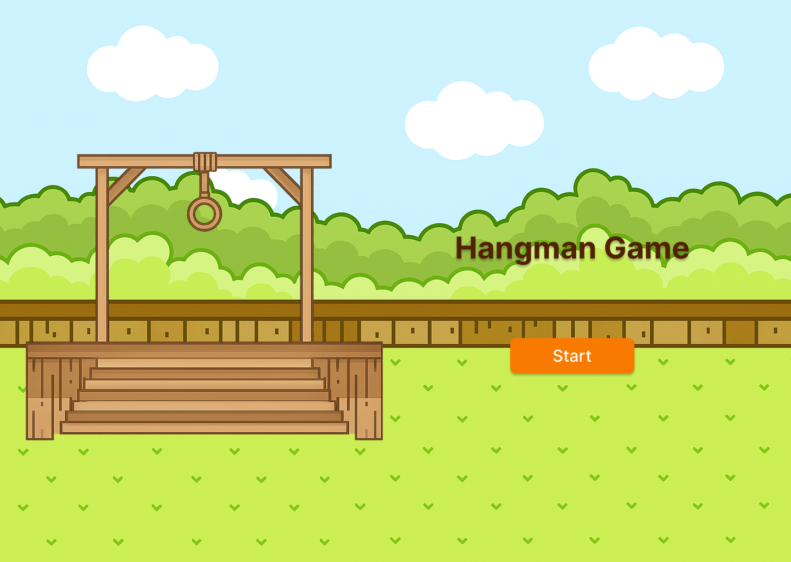
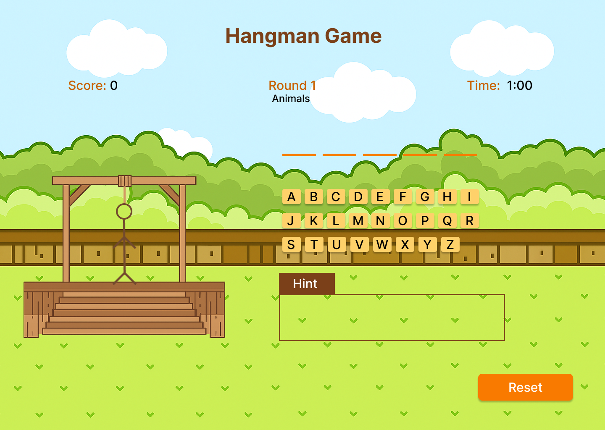

# Hangman Game
## Date: 9/17/2025
### By: Fatema Hussain
**[GitHub](https://github.com/Fatema-Abdulla) | [LinkedIn](https://www.linkedin.com/in/fatema-abdulla-bh)**
***
#### ***Description***

The Hangman game features a wide variety of words from multiple categories, offering a more diverse and exciting challenge. Players can choose between Easy and Hard modes. In Easy mode, the player has 4 minutes and 8 hints, while in Hard mode, the player is given 1 minute and 30 seconds with only 5 hints available.
***
#### ***Technologies Used***

* Visual Studio Code(VS Code)
    * HTML
    * CSS
    * JavaScript
***
#### ***Get Started***

The game has been uploaded and published; you can view the game [here](https://fatema-abdulla.github.io/hangman-game/).
***
#### ***WireFrame***
##### Home page

##### Play Game

***
#### ***Future features***
- [x] Increase number of round.
- [x] Increase number of words and category of words.
- [ ] Add 3 level easy, medium, hard.

***
#### ***Credits***

##### [Math.random()](https://stackoverflow.com/questions/1516695/js-math-random-for-array)
##### [setInterval()](https://stackoverflow.com/questions/31106189/create-a-simple-10-second-countdown)
##### [clearInterval()](https://developer.mozilla.org/en-US/docs/Web/API/Window/clearInterval)
##### [Create cursors](https://www.svgbackgrounds.com/elements/custom-css-cursors/)
##### [Add audio](https://developer.mozilla.org/en-US/docs/Web/API/HTMLAudioElement/Audio)
##### [Stop audio](https://stackoverflow.com/questions/14834520/html5-audio-stop-function)
##### [Mute audio](https://www.w3schools.com/jsref/prop_audio_muted.asp)
##### [Module](https://developer.mozilla.org/en-US/docs/Web/JavaScript/Guide/Modules?utm_source=chatgpt.com)
