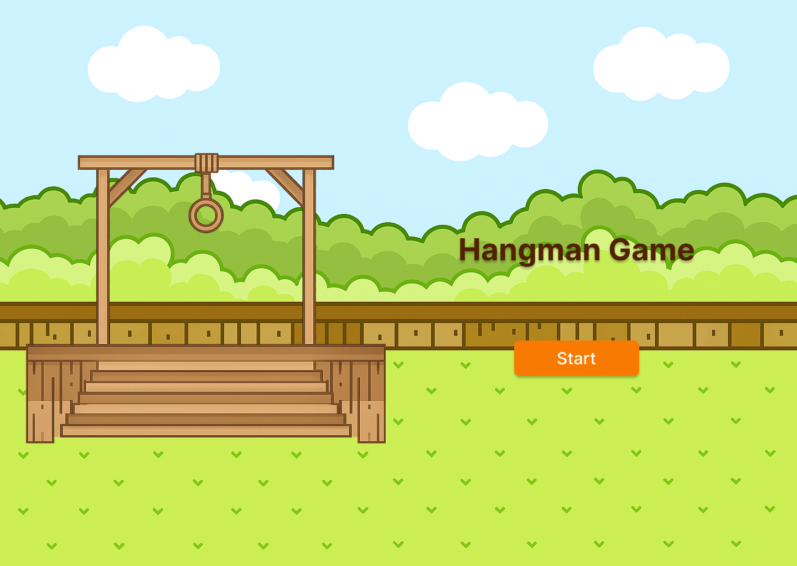

# Hangman Game
## Date: 9/11/2025
### By: Fatema Hussain
**[GitHub](https://github.com/Fatema-Abdulla) | [LinkedIn](https://www.linkedin.com/in/fatema-abdulla-bh)**
***
#### ***Description***

The Hangman game includes different words from the names of people, fruits, animals, and countries. Each player has a chance to guess the words by selecting the correct letters within one minute for each round. Correctly guessing the words increases your scores, but failing to do so will result in a loss.
***
#### ***Technologies Used***

* Visual Studio Code(VS Code)
    * HTML
    * CSS
    * JavaScript
***
#### ***Get Started***

The project has been uploaded and published; you can view the dashboard [here](#).
***
#### ***ScreenShots***
##### Hangman Game

***
#### ***Credits***

##### -
